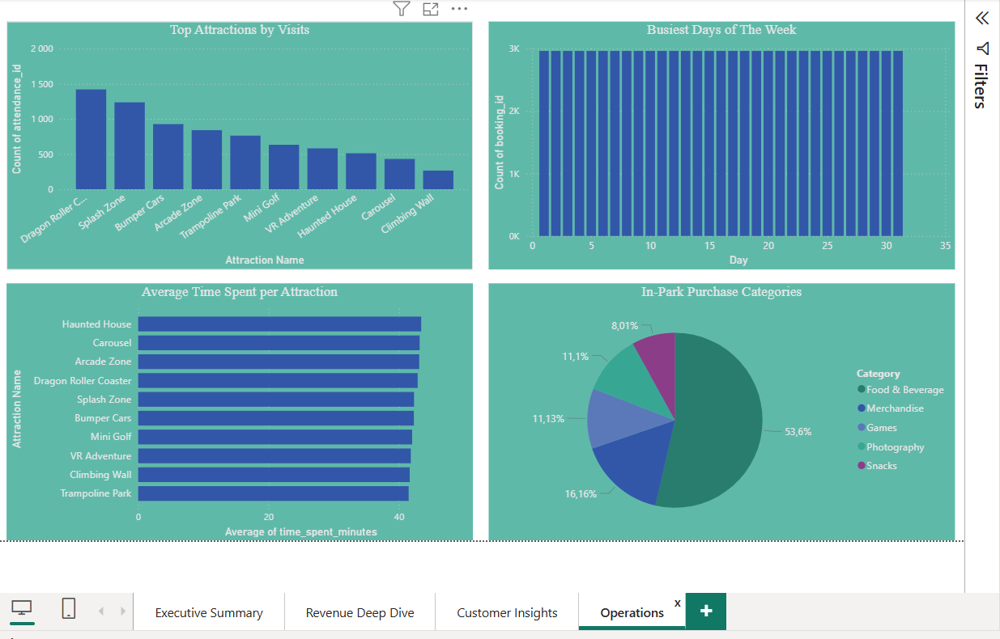

Happyville Indoor Amusement Park — Data Analytics Project

Project Overview:
Happyville is an indoor amusement park based in Harrismith, Free State, South Africa. 
This project analyzes booking data, in-park revenue, customer behavior, and operational 
performance to support business decision-making as the company transitions from 
walk-in only bookings to an online booking system.

Business Questions Answered:
- What is our total revenue across bookings and in-park purchases?
- Which ticket types generate the most revenue?
- How is monthly revenue trending across 2024?
- How is the online booking channel growing since its mid-2024 launch?
- Who are our repeat vs new customers?
- Which cities are our customers coming from?
- Which attractions are most popular and how long do customers spend there?
- What are our busiest days and peak seasons?

Tools Used:
- MySQL — data storage and SQL analysis
- Power BI — interactive dashboard and visualizations
- Microsoft Excel — data validation

Dataset:
The dataset contains 5 relational tables covering 2024:

| Table | Records | Description |
|---|---|---|
| customers | 2,000 | Customer profiles and demographics |
| bookings | 2,965 | Ticket bookings and revenue |
| in_park_purchases | 5,592 | Food, games and merchandise spend |
| attractions | 10 | Attraction details and capacity |
| attendance | 7,613 | Customer visits per attraction |

Key Insights:
- Total booking revenue of R1.04M generated across 2,965 bookings in 2024
- Adult tickets are the highest revenue ticket type
- December and July are peak months driven by school holidays
- Online bookings grew from 5% in January to 28% by December after mid-2024 launch
- Food & Beverage accounts for over 53% of all in-park purchases
- Dragon Roller Coaster and Splash Zone drive the majority of attraction visits
- 42% of customers come from Harrismith with Phuthaditjhaba as second largest market

Dashboard Preview
Executive Summary:

Revenue Deep Dive:

Customer Insights:

Operations:
happyville-data-analytics/
├── dashboard/     - Power BI file and screenshots
├── data/          - Raw CSV datasets
├── sql/           - SQL analysis queries
└── README.md

Author:
Zethembe Radebe  
Junior Data Analyst | Microsoft Certified Power BI Data Analyst 
📧 z.radebe884@gmail.com

## Repository Structure
